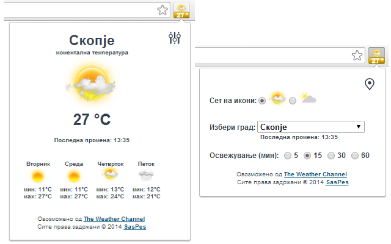
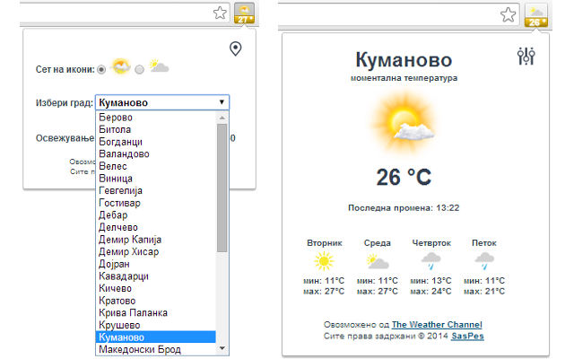

# Временска прогноза за Македонија

Click [here](https://chrome.google.com/webstore/detail/%D0%B2%D1%80%D0%B5%D0%BC%D0%B5%D0%BD%D1%81%D0%BA%D0%B0-%D0%BF%D1%80%D0%BE%D0%B3%D0%BD%D0%BE%D0%B7%D0%B0-%D0%B7%D0%B0-%D0%BC%D0%B0%D0%BA/jiolkebofokfhhhecjgkncaokljngnma) to download "Временска прогноза за Македонија" form "Chrome Web Store - Apps"

  

## Функционалности
- Mоментална температура
- Последна промена
- Мах и Мин темпратура за денес
- Тридневна прогноза
- Сет на икони
- Градови (вкупно 34)
- Oсвежување на 5, 15, 30 или 60 мин

## Градови
Берово  
Битола  
Богданци  
Валандово  
Велес  
Виница  
Гевгелија  
Гостивар  
Дебар  
Делчево  
Демир Капија  
Демир Хисар  
Дојран  
Кавадарци  
Кичево  
Кратово  
Крива Паланка  
Крушево  
Куманово  
Македонски Брод  
Македонска Каменица  
Неготино  
Охрид  
Пехчево  
Прилеп  
Пробиштип  
Радовиш  
Ресен  
Свети Николе  
Скопје  
Струга  
Струмица  
Тетово  
Штип  

Version: 1.0.1  
Updated: January 17, 2016  
Size: 141KiB  
Language: Macedonian